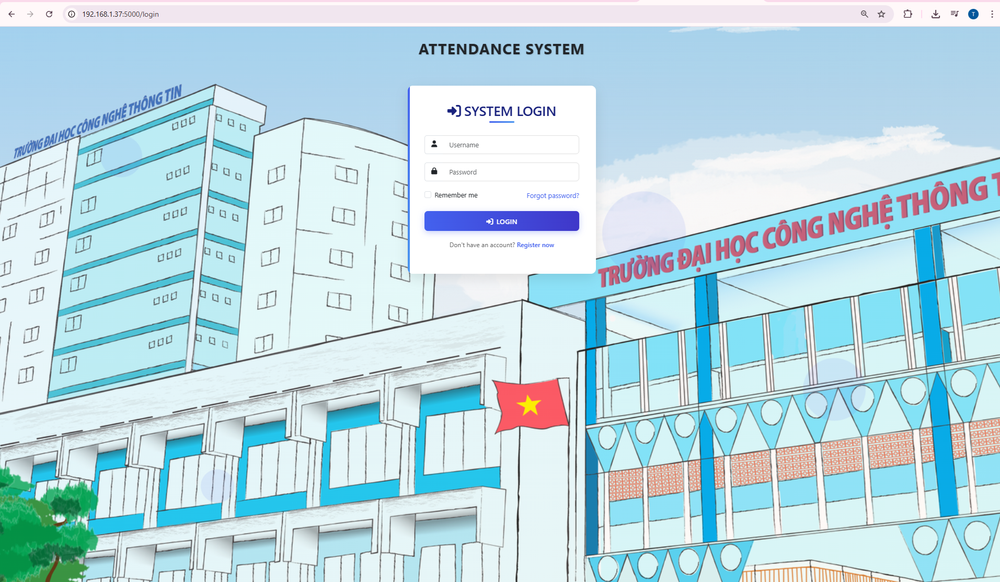

# FaceRecognition-Web-Door
## Demo
[📺 Xem demo ở đây](https://www.youtube.com/watch?v=YEjlg2-8C68)

## 🧠 Mô tả dự án

**FaceRecognition-Web-Door** là một hệ thống nhận diện khuôn mặt ứng dụng deep learning, triển khai trên nền tảng nhúng Raspberry Pi 4. Dự án kết hợp 2 ứng dụng:

- **Ứng dụng 1 – Web điểm danh:** Giao diện web Flask cho phép giảng viên quản lý điểm danh sinh viên thông qua nhận diện khuôn mặt.


- **Ứng dụng 2 – Mở cửa thông minh:** Thiết bị điều khiển đóng/mở cửa tự động bằng khuôn mặt, phát hiện người lạ và gửi cảnh báo.

## 🔍 Công nghệ sử dụng

| Thành phần | Công nghệ |
|-----------|-----------|
| Phát hiện khuôn mặt | YOLOv8 |
| Nhận diện khuôn mặt | MobileFaceNet |
| Backend | Flask |
| Database | SQLite |
| Thiết bị nhúng | Raspberry Pi 4 |
| Giao diện | HTML + CSS + JavaScript |
| Hardware | PIR sensor, Relay, Buzzer, LED, khóa từ |

## ⚙️ Tính năng

### 📌 Web điểm danh
- Đăng ký, đăng nhập tài khoản giảng viên.
- Quản lý lớp học và sinh viên.
- Nhận diện khuôn mặt sinh viên để điểm danh tự động.
- Cập nhật dữ liệu khuôn mặt.
- Thống kê, lưu trữ lịch sử điểm danh.
- Dashboard hiển thị tỷ lệ điểm danh, danh sách nhận diện.

### 🔐 Cửa thông minh
- Phát hiện chuyển động bằng cảm biến PIR.
- Nhận diện khuôn mặt trước khi mở cửa.
- Mở khóa bằng relay khi khuôn mặt hợp lệ.
- Cảnh báo âm thanh + LED nếu phát hiện người lạ.
- Gửi email cảnh báo nếu có truy cập không hợp lệ.

### 🖼️ Giao diện đăng nhập




## 🛠️ Hướng dẫn cài đặt

### Yêu cầu:
- Raspberry Pi 4 (4GB hoặc 8GB RAM)
- Camera USB/CSI
- Python 3.7+
- Thư viện Python:
  ```bash
  pip install -r requirements.txt
  ```

### Chạy ứng dụng:
```bash
# Khởi động web app Flask
python run.py
```

- Truy cập địa chỉ nội bộ: `http://<rasp_ip>:5000`
- Đăng nhập hoặc đăng ký tài khoản giảng viên để sử dụng dashboard.

## 🔌 Sơ đồ phần cứng

| GPIO | Thiết bị |
|------|----------|
| GPIO 24 | Cảm biến PIR |
| GPIO 23 | Buzzer |
| GPIO 22 | LED trắng |
| GPIO 27 | LED đỏ |
| GPIO 17 | Relay điều khiển khóa từ |

## 🧪 Đánh giá mô hình

- **Accuracy YOLOv8:** >87% trong môi trường thực.
- **Tốc độ trích xuất embedding:** ~10–15 FPS trên Raspberry Pi 4.
- **Cơ sở dữ liệu nhận diện:** Embedding 128 chiều bằng MobileFaceNet + ArcFace Loss.

## 🧱 Cấu trúc thư mục

```bash
FaceRecognition-Web-Door/
│
├── app1/                # Web Flask - điểm danh
├── static/              # CSS, JS
├── templates/           # Giao diện HTML
├── face_recognition_with_feedback.py  # Điều khiển phần cứng + nhận diện mở cửa
├── run.py               # Main Flask App
├── requirements.txt     # Thư viện cần cài
└── ...
```

## 📈 Hướng phát triển
- Thêm tính năng phát hiện khẩu trang hoặc mặt giả.
- Tối ưu nhận diện bằng GPU hoặc chuyển sang Jetson Nano.
- Tự động hóa đồng bộ lịch học từ hệ thống trường.
- Tích hợp phân tích hành vi người lạ.


## 🔗 Link demo & tài liệu
- 📹 [Demo hệ thống](https://drive.google.com/drive/folders/1uzMyPyNPbreyRnMfIy9W09ZUboi8NxAS?usp=sharing)
- 📄 [Báo cáo chi tiết](https://drive.google.com/drive/folders/1uzMyPyNPbreyRnMfIy9W09ZUboi8NxAS?usp=sharing)
